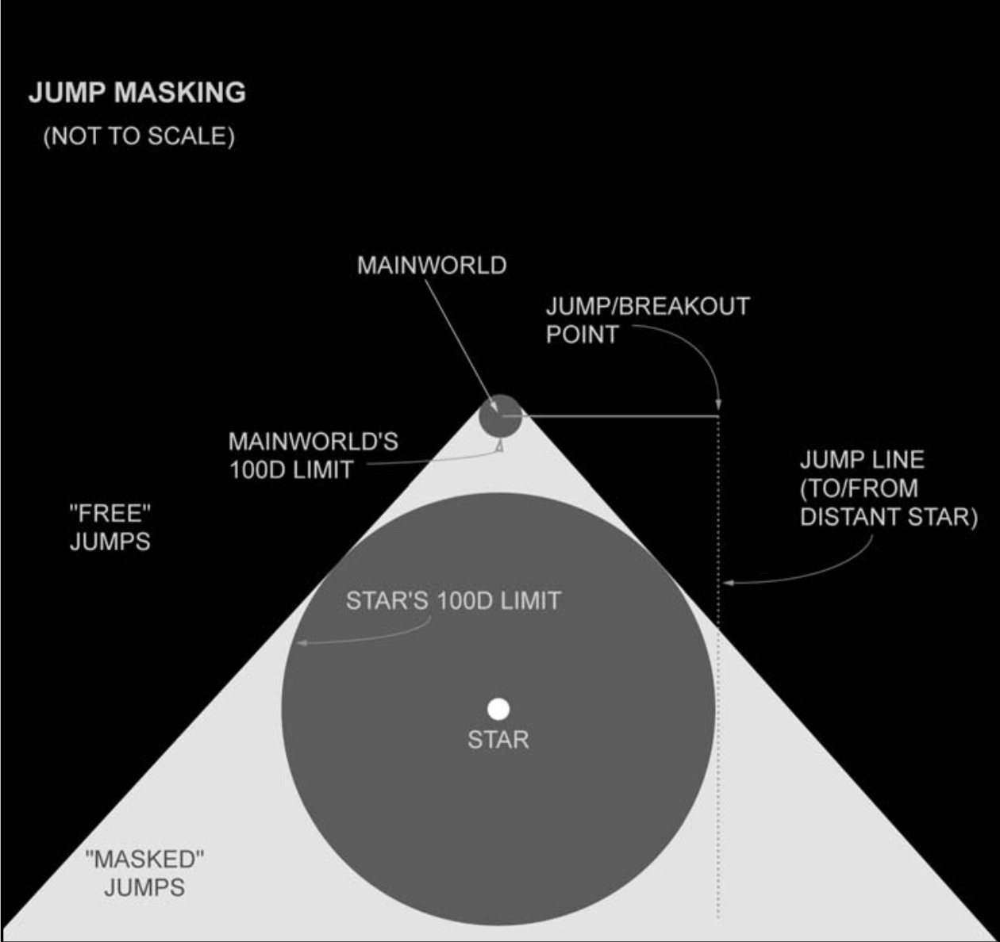
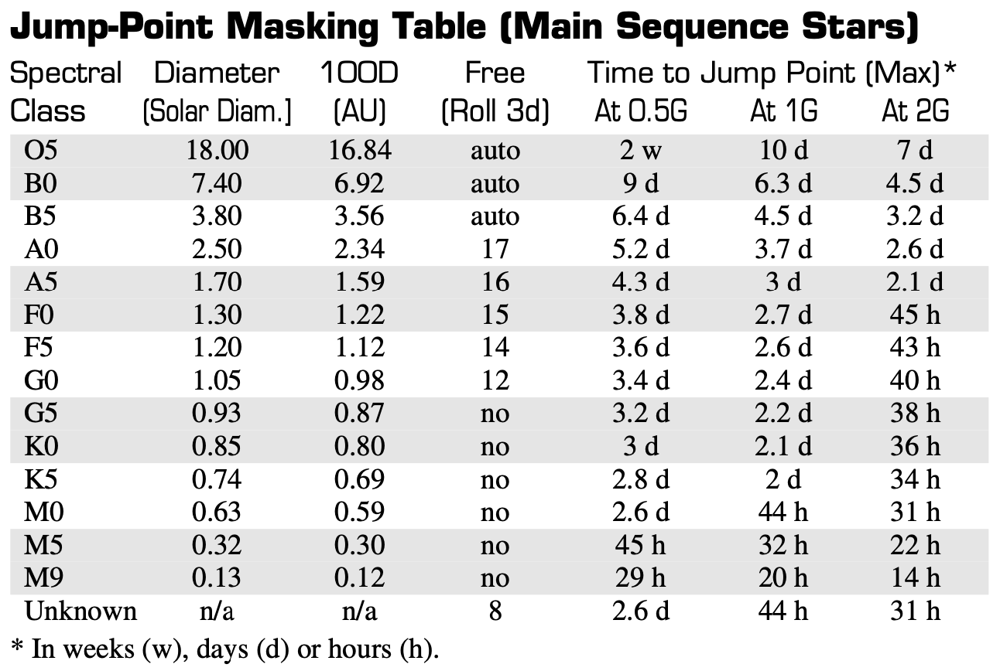
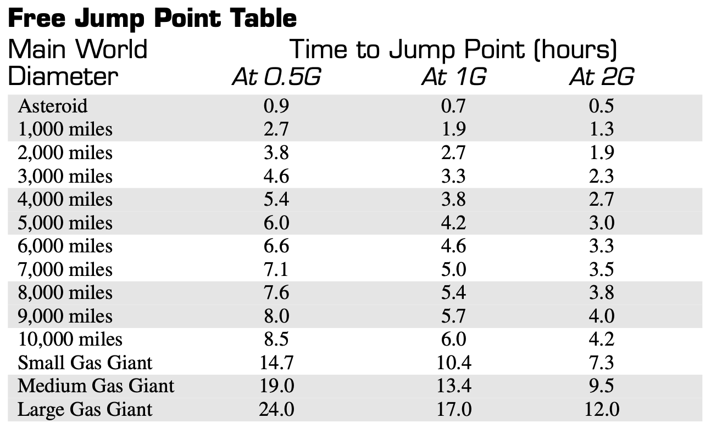
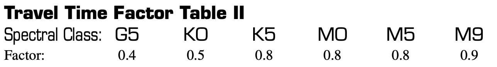
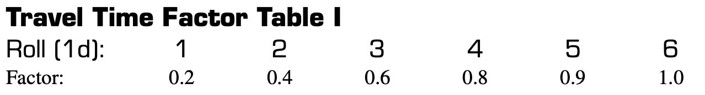

**SITUATION:** pre-jump, breakout

The concept of masking is based on the 100D limit when operating a jump drive. If a jump/breakout is executed within 100 diameters of a gravity well, there is a high chance of misjump. Designated jump points are therefor computed on the "jump line" (see diagram-a, jump masking).

A "masked jump" is one that occurs when the system primary's 100D limit masks all direct lines to your destination. If the direct line to the destination is not masked, go to "free jump".

# COMPUTE JUMP
Under normal conditions, USE THE NAV COMPUTER to compute the jump line.

If the nav computer is not operational or if extraordinary circumstances dictate the nav computer should not be used, use the following procedure.

# FREE JUMP
Compute travel time from breakout to destination based on the Main World's diameter.

# COMPUTE SYSTEM SIDE
	1-3: The breakout is on the near side of the system.
	4-6: The breakout is on the far side of the system.

# NEAR SIDE
Actual travel time depends on the spectral class of the system primary.

# FAR SIDE
Actual travel time depends on the position of the Main World relative to the system primary. Use **Table I** to compute the time factor based on this position. Compare the factor computed with that from **Table II** and use the higher of the two.

